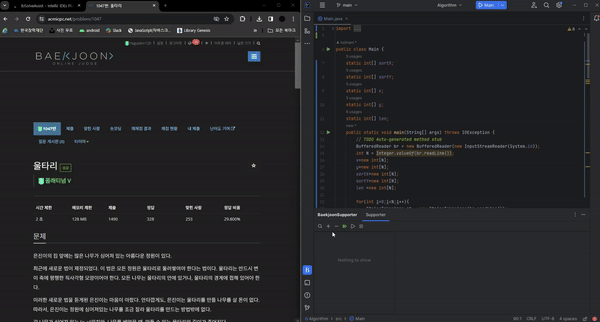
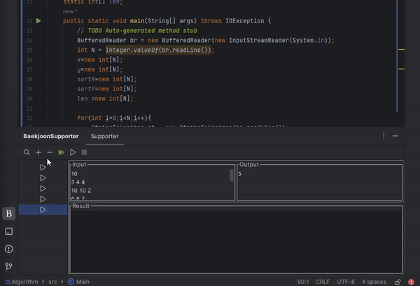
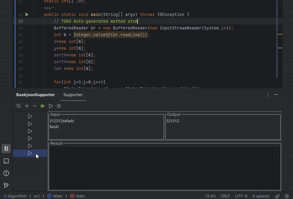
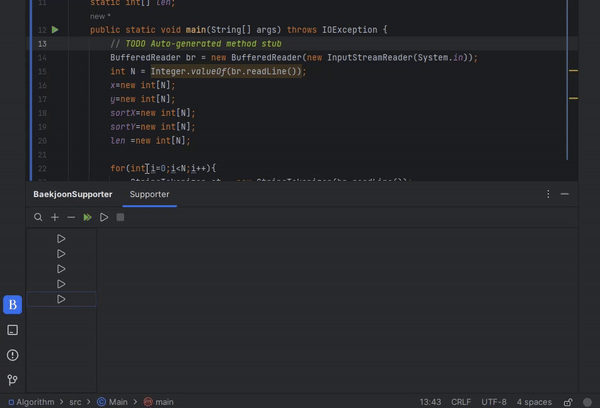
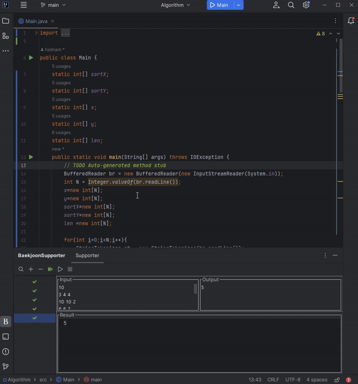
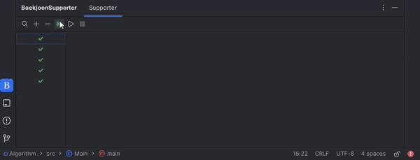

<h1>This Plugin supports you to solve Baekjoon easier</h1>

[Marketplace](https://plugins.jetbrains.com/plugin/23468-bjsolveassist)

<h1>Notification!</h1>
- Currently, it supports only `java` language. 
- It runs on your own computer environment. please install JDK on your device. 
- If your IDE version is not latest, UI might not update immediately. Please update your IDE version, set enable NEW UI, or resize our plugin tab.

<h2>Requirements</h2>
- jdk on your device

<h2>Functions</h2>
<ul>
<li>Can add test-case</li>
<li>Can remove test-case</li>
<li>Can run all tests</li>
<li>Can run one test</li>
<li>Can stop all running tests</li>
<li>Can assert results</li>
<li>Can load sample data in baekjoon</li>
<li>This time, only java can use</li>
</ul>

<h2>How to use</h2>
<h3>Load test data</h3> 

<h3>Add test case</h3> 

<h3>Remove test case</h3> 

<h3>Run all tests</h3>

<h3>Run test</h3>

<h3>Run test with context menu</h3>

<h3>Stop all tests</h3>

